# Gramar Checker

    

> A tool to support grammar checking, sentence rewriting, and text translation. Supports text input from voice images.

## Download

Download the apk file [here](https://google.com) and install it on your phone

## Interface

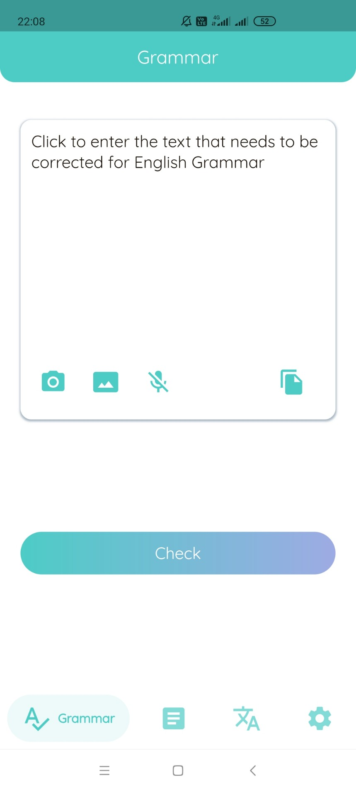
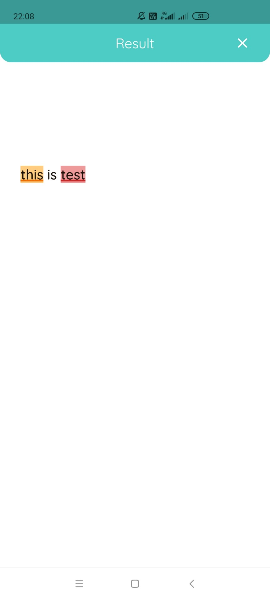
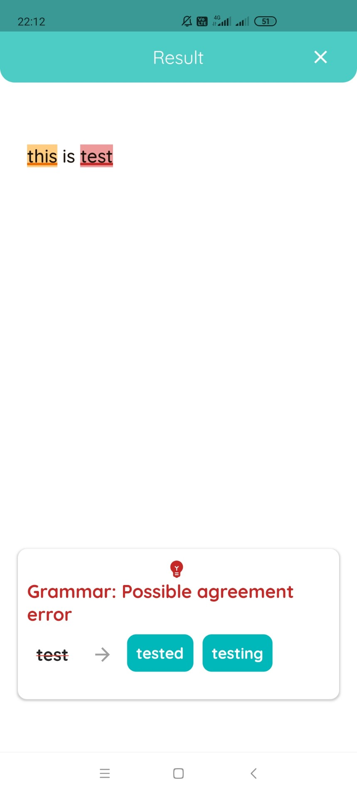
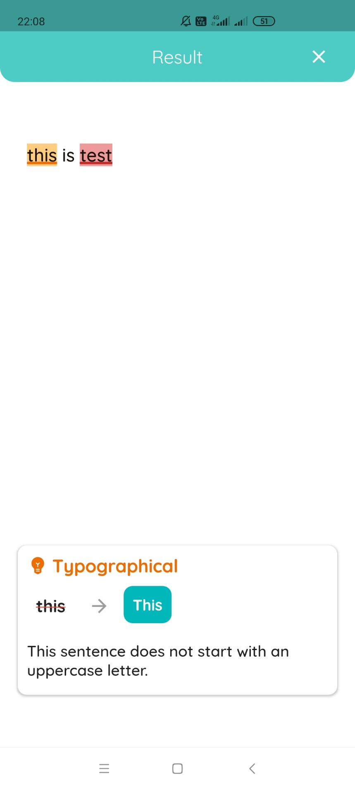
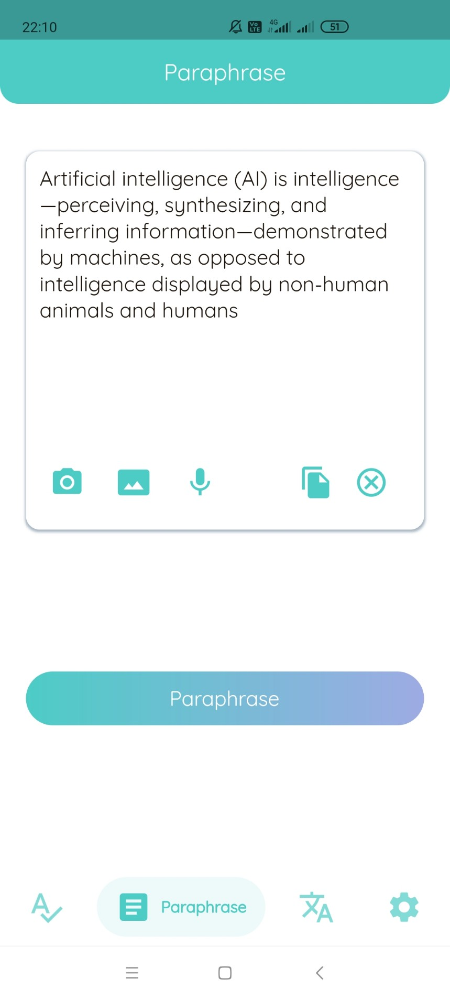
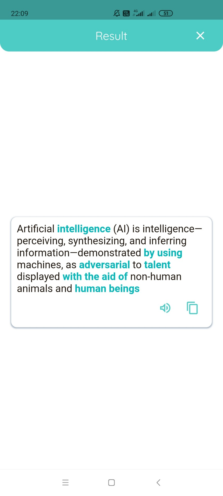
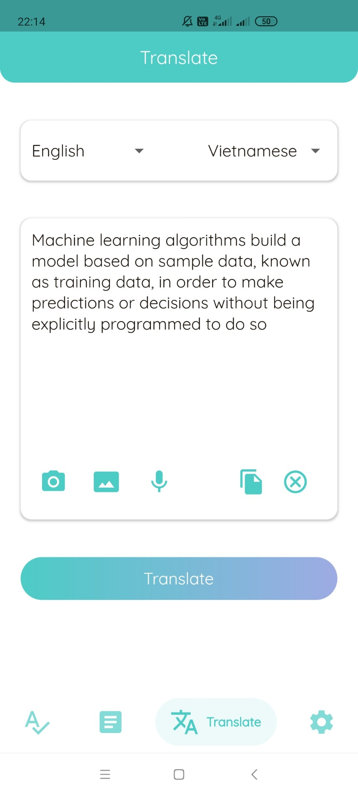
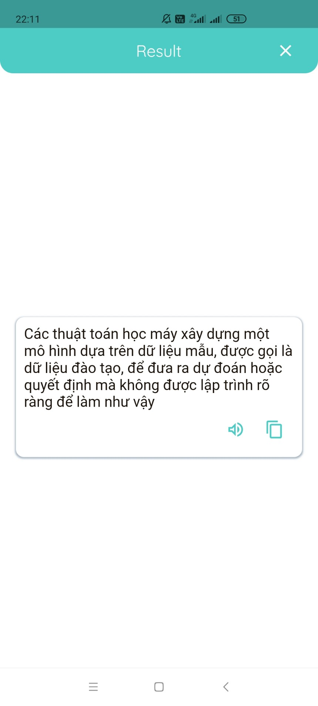
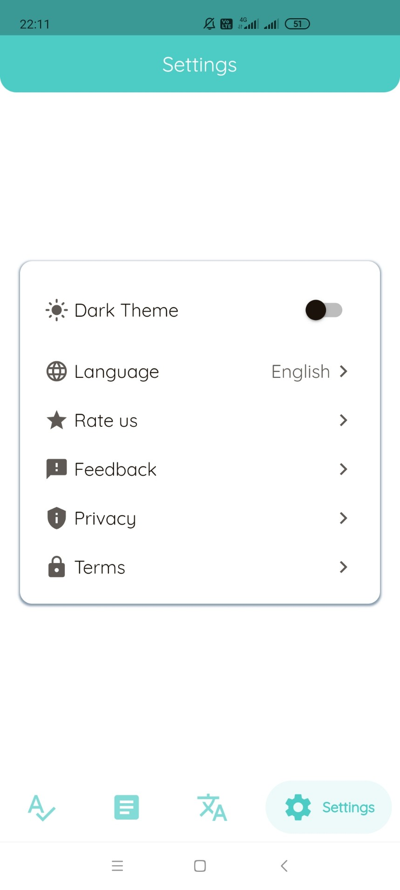
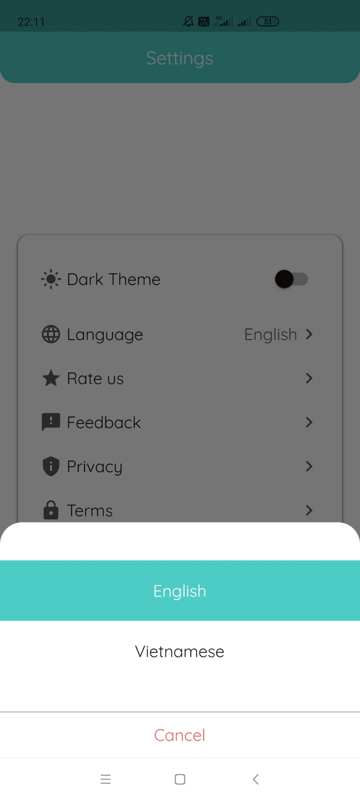
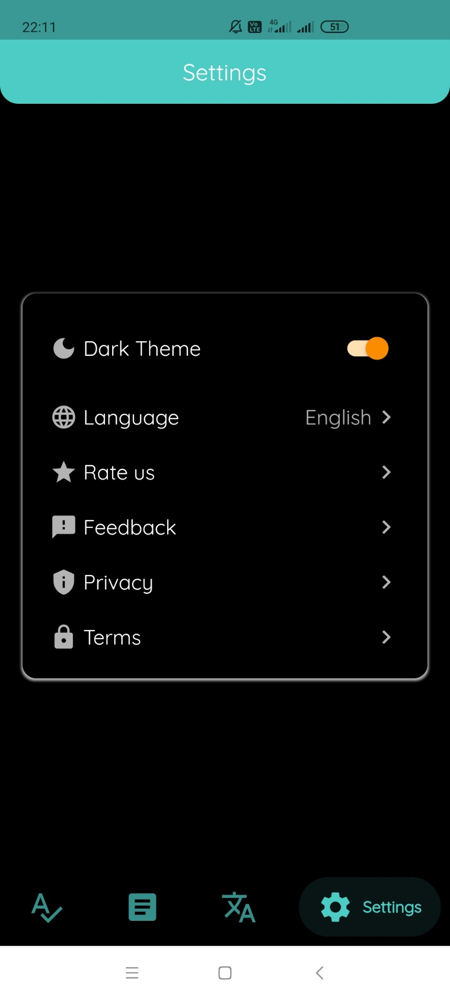

## Contributors

Application developed by me [Duong Thanh Nguyen](https://github.com/nguyendt-tn)
